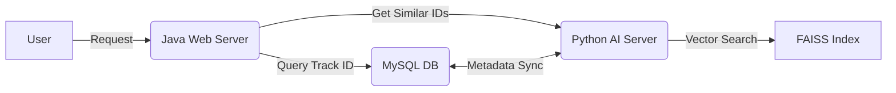

# 🎵 AI-Based Music Recommendation System

## Audio Content Analysis & Hybrid Recommendation Engine

본 프로젝트는 **오디오 신호 처리(Signal Processing)** 기술을 활용하여 음악의 고유 특징을 분석하고,  
사용자가 듣고 있는 곡과 **가장 유사한 분위기의 곡을 추천**하는 AI-Web 하이브리드 시스템입니다.

---

# 1. System Architecture

이 시스템은 **2-Tier Hybrid Architecture**로 구성됩니다.

### **Python AI Server (Backend)**

- 오디오 특징 추출
- 벡터 인덱싱
- 유사도 계산 엔진 제공

### **Java Web Server (Frontend / Controller)**

- 사용자 UI
- 비즈니스 로직
- 회원/로그 관리

### **MySQL Database**

- 메타데이터 저장소
- 사용자 로그 관리

### Architecture Flow



---

# 2. Core Logic: Audio Fingerprinting

텍스트 기반 검색이 아닌, **소리(Audio Content)** 자체를 기반으로 유사 음악을 추천합니다.

## 2.1 Feature Extraction (특징 추출)

**Librosa**를 통해 오디오에서 수학적 특징을 분석합니다.

- **Method:** MFCC
- **Sampling Rate:** 22,050Hz
- **Coefficients:** 20 MFCCs
- **Dimension Reduction:** Mean + Variance
- **Final Vector:** `40-D (20 Mean + 20 Var)`

## 2.2 Vector Similarity Search (유사도 검색)

- **Library:** FAISS
- **Algorithm:** L2 Distance
- **Speed:**
  - 8,000곡 기준 **< 1ms** (CPU)

---

# 3. Data Pipeline (ETL)

| Step            | Script         | Description                     | Tech Stack               |
| --------------- | -------------- | ------------------------------- | ------------------------ |
| 1. Extract      | (raw)          | MP3 + metadata(tracks.csv) 로드 | Pandas                   |
| 2. Transform    | build_index.py | 오디오 디코딩 → MFCC → 벡터화   | Librosa, Multiprocessing |
| 3. Load (Index) | build_index.py | music.index (FAISS 파일) 생성   | FAISS                    |
| 4. Load (DB)    | migrate_db.py  | metadata → MySQL 적재           | MySQL Connector          |

---

# 4. Database Schema (MySQL)

### `users`

- id
- password
- nickname

### `tracks`

- track_id
- title
- artist
- genre
- file_path

### `recommendations`

- user_id
- track_id
- type (SIMILAR / DAILY)
- timestamp

---

# 5. Project Structure

```
music-recommender/
├── ai-server/                # [Python] AI Recommendation Engine
│   ├── data/                # Raw Data (MP3, CSV)
│   ├── models/              # Artifacts (music.index)
│   ├── src/
│   │   ├── build_index.py   # Feature Extraction & Indexing
│   │   ├── migrate_db.py    # MySQL Data Migration
│   │   └── app.py           # Flask REST API
│   └── requirements.txt
│
└── web-server/              # [Java] Web Application (Phase 3)
    └── (To be implemented)
```

---

# 6. How to Run (Python Module)

## **Prerequisites**

- Python 3.9+
- MySQL 8.0+
- FFmpeg

## **Setup & Execution**

```bash
# 1. Install Dependencies
pip install -r requirements.txt

# 2. Build Vector Index (Heavy Task)
cd ai-server/src
python build_index.py

# 3. Migrate Metadata to Database
python migrate_db.py

# 4. Run Recommendation API Server
python app.py
```
